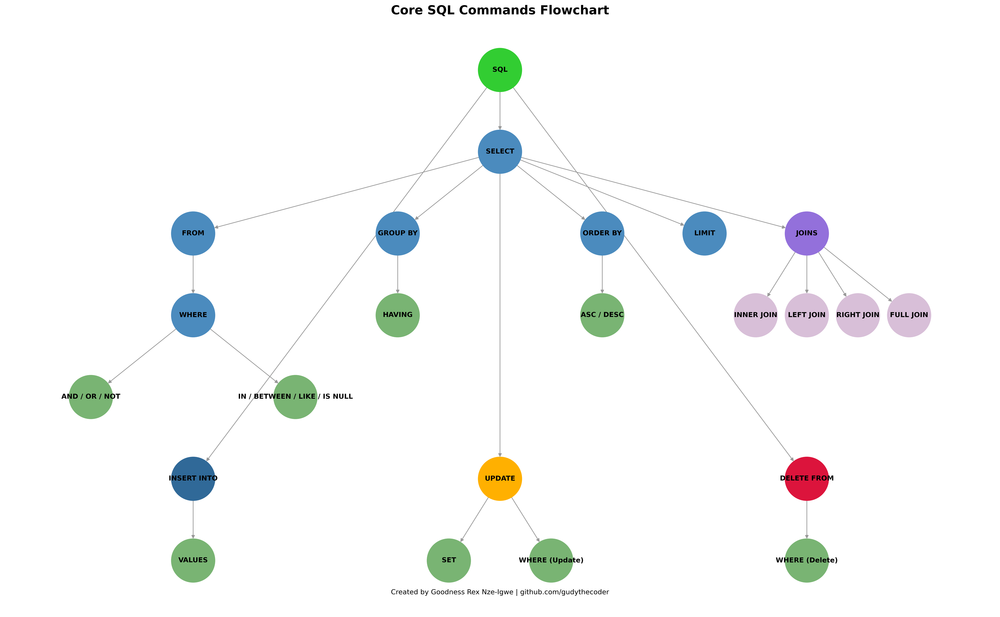

## Core SQL Commands Flowchart

This is a visual summary of essential SQL operations, designed as a flowchart using `matplotlib` and `networkx`.

### What's Included:
- `SELECT`, `FROM`, `WHERE`, `GROUP BY`, `ORDER BY`, `LIMIT`
- Logical conditions like `IN`, `LIKE`, `BETWEEN`, `AND`, `OR`
- All major `JOIN` types: INNER, LEFT, RIGHT, FULL
- `INSERT`, `UPDATE`, `DELETE` operations

###  Built With:
- Python
- Matplotlib
- NetworkX

###  Purpose:
To provide a quick, intuitive reference for SQL learners and professionals.

